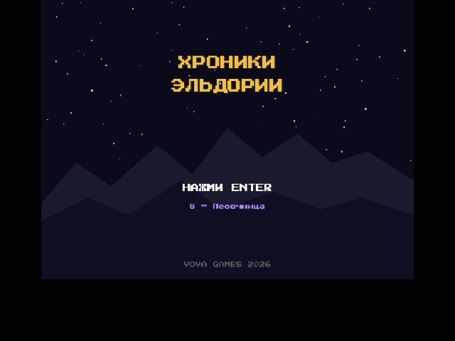
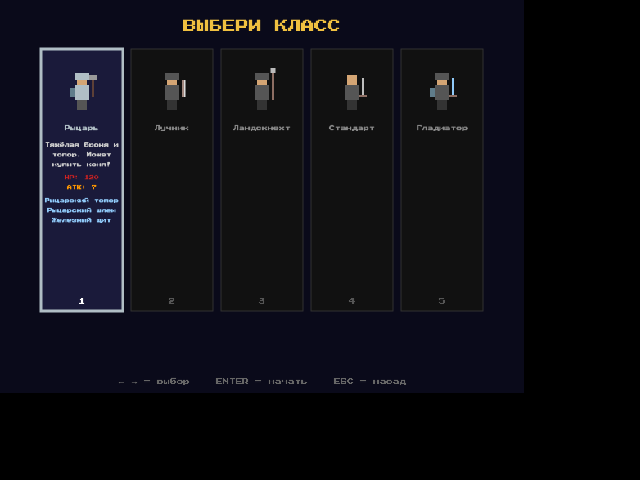
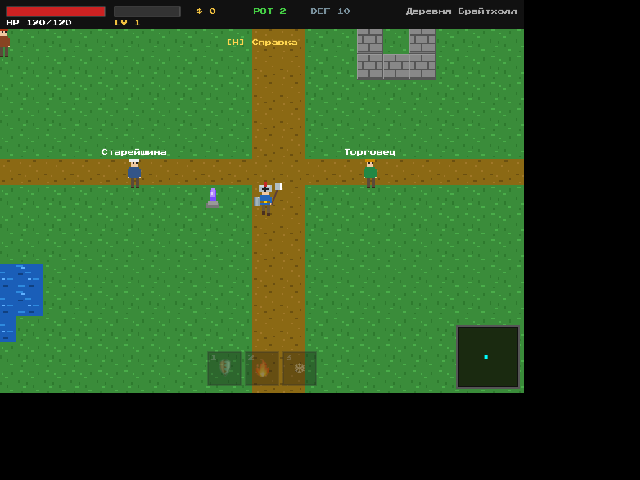

# Хроники Эльдории

> Пиксельная Action-RPG в браузере. HTML5 Canvas + Vanilla JavaScript. Без зависимостей.



| Выбор класса | Геймплей |
|:---:|:---:|
|  |  |

---

## Быстрый старт

```bash
# Локальный сервер (нужен для ES modules)
python3 -m http.server 8080
# или
npx serve .
```

Открыть `http://localhost:8080` в браузере.

**Docker (Synology / сервер):**

```bash
docker-compose up -d --build
# Доступно на порту 3040
```

---

## Управление

### Клавиатура

| Клавиша | Действие |
|---------|----------|
| WASD / Стрелки | Движение |
| Пробел | Атака |
| E | Говорить с NPC |
| Q | Использовать зелье |
| 1, 2, 3 | Способности стихий |
| I | Инвентарь |
| J | Журнал квестов |
| H | Справка |
| M | Музыка вкл/выкл |
| ESC | Выход в меню (с сохранением) |

### Мобильное управление

Боковые панели с сенсорным управлением. Игровая область сохраняет пропорции 4:3.

| Левая панель | Правая панель |
|:---:|:---:|
| Виртуальный джойстик | Атака, Взаимодействие, Зелье |
| Музыка (M), Справка (?) | Инвентарь, Способности 1-2-3 |
| | Меню, Квесты (J) |

Поддерживается тактильная отдача (Vibration API) на Android: удар по врагу, получение урона, повышение уровня, смерть — каждое событие с уникальным паттерном вибрации.

---

## Классы персонажей

Выбор при старте новой игры.

| Класс | Оружие | Доспехи | Особенность |
|-------|--------|---------|-------------|
| **Рыцарь** | Рыцарский топор | Рыцарский шлем + Железный щит | Может купить коня |
| **Лучник** | Лук | Кожаный шлем + нагрудник | Стреляет издалека |
| **Ландскнехт** | Копьё | Железный шлем + кольчуга + кожаные поножи | Дальний ближний бой |
| **Стандарт** | Железный меч | -- | +50 монет на старте |
| **Гладиатор** | Стальной меч | Сет гладиатора + деревянный щит | Боец арены |

---

## Игровой мир

### Локации (9)

| Локация | Тип | Враги | Босс |
|---------|-----|-------|------|
| Деревня Брайтхолл | Мирная | -- | -- |
| Королевский замок | Мирная | -- | -- |
| Темный лес | Боевая | Слаймы, Волки, Бандит | Лесной страж |
| Огненное ущелье | Боевая | Скелеты, Бандиты | Огненный дракон |
| Ледяная пещера | Боевая | Големы, Бандиты | Ледяной лич |
| Замок Темного мага | Боевая | Стражники, Рыцарские стражи | Темный маг |
| Адская яма | Босс-арена | -- | ЗлойРокДемон (10M HP) |
| Арена | Бесконечная | Гладиаторы (волны) | -- |
| Подземелья | Процедурная | Рандомные (по глубине) | Рандомный |

### Боссы (6)

Каждый босс имеет уникальные фазы, визуал и диалог перед боем.

| Босс | HP | Фазы | Дроп |
|------|----|------|------|
| Лесной страж | 200 | Круг / Рывок | Артефакт Земли |
| Огненный дракон | 300 | Стрельба / Рывок / Бешенство | Артефакт Огня |
| Ледяной лич | 250 | Телепорт / Бешенство | Артефакт Воды + Меч Бальдионидов |
| Темный маг | 10B | Стрельба / Телепорт / Бешенство | Победа! |
| ЗлойРокДемон | 10M | Рывок / Стрельба / Телепорт / Бешенство | Меч РокДемона + Щит РокДемона |
| Тёмный рыцарь | 200 | Рывок / Бешенство | -- |

---

## Экипировка

### Оружие (18+ видов)

| Тип | Оружие | ATK | Цена | Источник |
|-----|--------|-----|------|----------|
| **Мечи** | Железный / Стальной / Мифриловый | 0 / 3 / 6 | 0 / 50 / 120 | Магазин |
| | Меч РокДемона (10% крит) | 50 | -- | Дроп с РокДемона |
| **Копья** | Обычное / Огненное / Рыцарское | 2 / 5 / 10 | 40 / 100 / 200 | Магазин |
| **Луки** | Лук / Арбалет | 1 / 4 | 80 / 150 | Магазин |
| **Топоры** | Железный / Стальной / Гладиатора / Рыцарский | 4 / 7 / 9 / 12 | 60-250 | Магазин |
| **Двуручники** | Железный / Стальной / Рыцарский | 12 / 20 / 30 | 80-300 | Магазин |
| | Меч Бальдионидов | 10M | 999999 | Дроп с Лича / Магазин |
| **Дроп** | Костяной меч, Бандитское оружие (4 вида) | 1-3 | -- | 100% дроп |

> Копья бьют одну цель за удар. Двуручники отключают щит.

### Доспехи (7 тиров)

Кожа -> Кольчуга -> Железо -> Гладиатор -> Мифрил -> Рыцарские -> **Доспехи богов**

| Тир богов | DEF | Слот |
|-----------|-----|------|
| Шлем Ферида | +800 | Шлем |
| Кольчуга Эзаниллы | +1000 | Нагрудник |
| Поножи Иомерида | +900 | Поножи |

### Щиты (7 видов)

Каждый щит имеет уникальный визуал.

| Щит | Блок | DEF | Особенность |
|-----|------|-----|-------------|
| Деревянный | 20% | 1 | -- |
| Железный | 40% | 3 | -- |
| Огненный | 70% | 2 | -- |
| Мифриловый | 60% | 5 | +15 HP |
| Зеркальный | 80% | 4 | Отражает снаряды |
| Щит Моремирида | 100% | 1000 | x3 отражение |
| Щит РокДемона | 60% | 2000 | x3 отражение, дроп |

---

## Наёмники

Нанимаются в Королевском замке за 100 монет. Макс. количество = уровень + 1. Наёмники смертны.

| Наёмник | Роль | HP | ATK | Особенность |
|---------|------|----|-----|-------------|
| Дарен | Мечник | 120 | 15 | Сбалансированный |
| Рольф | Копейщик | 100 | 18 | Дальний ближний бой |
| Ивар | Лучник | 80 | 12 | Стреляет издалека |
| Гром | Топорщик | 150 | 22 | Сильнейший удар |
| Бронк | Танк | 250 | 10 | Принимает удары |
| Зефир | Клинок | 70 | 20 | Сверхбыстрый |
| Лиана | Целитель | 60 | -- | +15 HP игроку, +10 отряду каждые 2 сек |
| Аркан | Маг | 65 | 25 | Дальние магические атаки |

---

## Игровые системы

| Система | Описание |
|---------|----------|
| Классы | 5 классов с уникальной стартовой экипировкой |
| Прокачка | 10 уровней, HP и ATK растут |
| Стихии | 3 способности: Щит Земли, Огненный шар, Ледяная волна |
| Инвентарь | Экипировка, покупка, продажа (X) |
| Квесты | 10 мини-квестов с трекером |
| Чекпоинты | Фиолетовые кристаллы, респавн при смерти |
| Сохранение | localStorage, автосохранение при смене локации |
| Подземелья | Процедурная генерация, бесконечная глубина |
| Арена | Волны гладиаторов, 100$ за победу |
| Боевой конь | +60% скорость, +50% урон (300$ у конюха) |
| Наёмники | 8 видов, следуют, атакуют, умирают |
| Боссы | Диалоги перед битвой, многофазовый AI |
| Звуки | Web Audio API, процедурная музыка |
| Песочница | Бессмертие, все предметы, режим с меню |

---

## Технологии

- **HTML5 Canvas** -- рендер, пиксель-арт
- **Vanilla JavaScript** -- ES6 modules, без фреймворков
- **Web Audio API** -- процедурные звуки и музыка (без файлов)
- **Press Start 2P** -- пиксельный шрифт (Google Fonts)
- **Docker + nginx:alpine** -- деплой на Synology / сервер
- **Ноль внешних зависимостей**

## Лицензия

MIT
